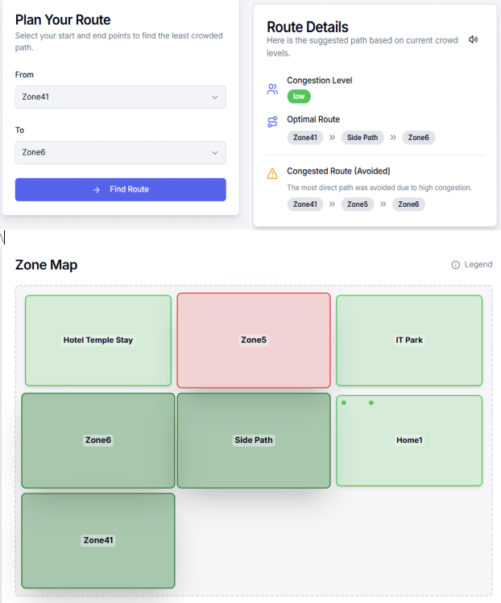

# EvacAI

**EvacAI** is a high-performance, real-time crowd management and emergency navigation platform designed for large-scale event spaces. It empowers both event organizers and attendees with live data to ensure safety and efficiency during high-density gatherings.

## 🚀 Mission
"Navigate smarter, not harder." EvacAI aims to eliminate bottleneck congestion and provide immediate emergency response coordination through a synchronized cloud-based ecosystem.

## 🛠 Tech Stack
- **Framework:** [Next.js 15 (App Router)](https://nextjs.org/)
- **UI/UX:** [React](https://reactjs.org/), [Tailwind CSS](https://tailwindcss.com/), [ShadCN UI](https://ui.shadcn.com/)
- **Backend:** [Firebase Firestore](https://firebase.google.com/products/firestore) (Real-time Database)
- **Authentication:** [Firebase Auth](https://firebase.google.com/products/auth) (Anonymous & Persistent)
- **Mapping:** [Google Maps JavaScript API](https://developers.google.com/maps/documentation/javascript/overview)
- **Icons:** [Lucide React](https://lucide.dev/)

## ✨ Key Features

### 👤 User Dashboard (The Navigator)
- **Real-Time Location Tracking:** Uses a Ray-Casting algorithm to identify exactly which event zone you are in.
- **Smart Route Planning:** Optimizes paths based on current crowd density, not just distance.
- **SOS Emergency Signal:** One-tap emergency broadcast that notifies admins of your exact location.
- **Broadcast Alerts:** Instant targeted safety instructions pushed directly to your screen via Firestore listeners.

### 🛡 Admin Central (The Command Center)
- **Zone Management:** Create and edit geographical boundaries directly on satellite maps using an interactive Google Maps selector.
- **Live Density Monitoring:** Automatic calculation of crowd levels based on active user counts.
- **Manual Overrides:** Admins can manually set a zone to "Overcrowded" to proactively redirect traffic.
- **SOS Monitor:** A dedicated command view for responding to active distress signals in the field.
- **User Activity Audit:** Real-time visibility into active and logged-out users across all zones.

## 🧠 Core Algorithms

### 1. Route Optimization (Dijkstra's Algorithm)
Located in `src/lib/actions.ts`.
EvacAI uses a weighted **Dijkstra’s Algorithm** to find the "Safety-First" path. Unlike standard GPS which looks for the shortest distance, our algorithm assigns "costs" based on crowd density:
- **Free:** Cost 1
- **Moderate:** Cost 3
- **Crowded:** Cost 10
- **Over-crowded:** Cost 100
This ensures users are naturally guided away from congestion points.

### 2. Geofencing (Ray-Casting Algorithm)
Located in `src/components/user/user-dashboard.jsx`.
To determine which zone a user is in without expensive server-side processing, we use a **Point-in-Polygon (PIP)** algorithm. By projecting an infinite horizontal ray from the user's GPS coordinates, we count intersections with zone boundaries to determine occupancy instantly on the client side.

## 📁 Project Structure
- `src/app`: Next.js routing and layouts.
- `src/components`: UI components organized by feature (Admin, User, Layout).
- `src/firebase`: Core Firebase initialization, real-time hooks (`useCollection`, `useDoc`), and error handling.
- `docs/backend.json`: Blueprint for the Firestore data structure and Authentication providers.
- `docs/ALGORITHMS.md`: Detailed documentation on the mathematical logic driving the platform.

## 🔑 Environment Variables
To run this project, ensure the following are configured in your `.env`:
- `NEXT_PUBLIC_GOOGLE_MAPS_API_KEY`: Your Google Maps API key with "Maps JavaScript API" enabled.
- Firebase credentials (automatically handled in the Firebase Studio environment).

---
Built with safety in mind for the next generation of event management.

